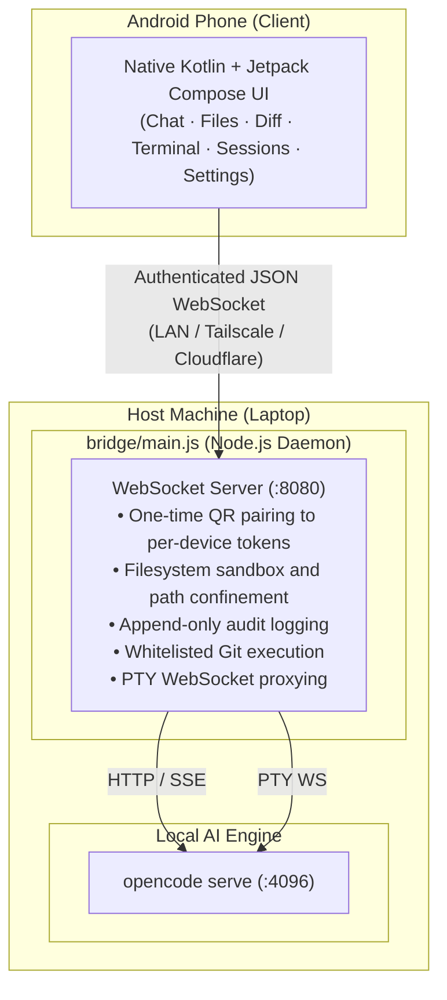

# OpenCode Remote

A secure, native mobile control surface for [OpenCode](https://opencode.ai) running on your development machine, operated directly from an Android phone.

OpenCode handles your repositories, shell commands, language servers, and filesystem operations locally on your laptop. OpenCode Remote pairs with that local daemon over an authenticated, encrypted WebSocket connection, giving you a full mobile interface to steer agents, stream tokens in real time, review multi-file diffs, answer interactive permission requests, and drop into an authentic PTY terminal from anywhere on your network.

Zero cloud intermediaries. Zero external relays. Your code, shell, and credentials never leave your personal network.

---



---

## Why This Exists

Using mobile browser interfaces or raw SSH shells on a phone screen is painful:

- **Mobile web UIs** drop background WebSocket connections, choke on long streaming Server-Sent Events (SSE) buffers, and lack native touch ergonomics.
- **Raw SSH** works for quick terminal fixes, but does not provide structured diff reviews, token-by-token streaming response cards, clickable permission gates, or file trees.

OpenCode Remote solves this by running a dedicated, native Android application backed by a hardened local bridge process:

1. **True Background Resilience**: Uses Android lifecycle-aware connection handlers. If your phone locks or changes Wi-Fi networks, the connection resumes and syncs state without killing the running prompt or restarting the session.
2. **Interactive Steering**: When the agent requests tool permissions (like file writes or shell execution) or asks clarifying questions, native Material 3 alert cards let you inspect and approve them in one tap.
3. **Hardware PTY Terminal**: A true pseudo-terminal surface handling raw ANSI codes, line-wrapping, and dynamic terminal window resizing (`cols` and `rows`).
4. **Isolated Device Security**: Designed from day one with per-device cryptographic tokens, path confinement, and local audit logging.

---

## What Works Today

Every capability below is backed by end-to-end integration tests (`npm test` on the bridge, unit tests on Android) and verified on physical hardware:

- **Real-Time Token Streaming**: Relays OpenCode's `/event` SSE feed to emit live text deltas, tool invocation cards, and execution results.
- **Mid-Task Steering & Cancellation**: Interrupt running agent loops or steer running tasks with concurrent message queuing.
- **Interactive Permissions & Questions**: View requested permissions (`bash`, `write_file`, etc.) and submit prompt answers directly from mobile cards.
- **Full PTY Terminal**: Interactive shell execution with automatic font-metric row and column recalculation upon screen rotation or keyboard popup.
- **Multi-File Diff Reviewer**: Unified diff viewing with live diff-on-edit updates as tools modify files on disk.
- **Multi-Session Management**: List, create, switch, and fork sessions. Session IDs persist across bridge restarts in `.opencode-remote-session.json`.
- **Workspace Navigation & File Explorer**: Browse workspace file trees, view syntax-highlighted source files, and switch between registered project directories safely confined to `WORKSPACE_ROOT`.
- **Safe Git Interface**: Run whitelisted git operations (`status`, `add`, `commit`, `diff`, `log`, `branch`, `stash`, `push`, `pull`, `checkout`) with strict quote-aware tokenization and shell-injection defenses.
- **Per-Device Token Auth**: Pairing via QR code issues an isolated, persistent device token saved to `~/.opencode-remote-devices.json`. Revoke lost phones instantly from Settings.
- **Append-Only Audit Log**: Records every terminal command, git action, and permission decision with timestamps and device IDs to `.opencode-remote-audit.log`.

---

## Prerequisites

### On your Laptop / Host Machine
- **Node.js** 18+ (tested on Node v20 and v24)
- **OpenCode CLI** installed and available on your system `PATH` (see [opencode.ai](https://opencode.ai))
- **Git** installed and configured

### On your Android Device / Development Environment
- **Android Device or Emulator** running Android 7.0+ (API level 24 minimum, target/compile SDK 36)
- **Android Studio** (Ladybug / Meerkat or newer recommended)
- **JDK 17+** (Gradle toolchain will auto-provision if needed)

---

## Quickstart

### 1. Launch the Bridge (Host Machine)

Clone the repository and install the lightweight Node.js dependencies:

```bash
cd bridge
npm install
npm test        # Verify test suite (37 passing tests)
npm start
```

Upon boot, the bridge prints:
1. A QR code in your terminal.
2. A raw pairing string in the format `ip=<your-lan-ip>;key=<random-token>`.
3. The port the server is listening on (default: `8080`).

#### Environment Configuration

You can customize the bridge behavior via environment variables:

| Variable | Default | Description |
|---|---|---|
| `PORT` | `8080` | WebSocket listen port |
| `OPCODE` | `opencode` | Executable path for OpenCode CLI |
| `BRIDGE_TOKEN` | *Random 32-byte hex* | One-time pairing secret printed on startup |
| `WORKSPACE_ROOT` | Current working directory | Root filesystem boundary for file and workspace confinement |
| `DEVICE_STORE_PATH` | `~/.opencode-remote-devices.json` | Path where authorized device tokens are stored |
| `AUDIT_LOG_PATH` | `<WORKSPACE_ROOT>/.opencode-remote-audit.log` | JSON-lines append-only audit trail file |
| `OC_SERVE_PORT` | `4096` | Port used when spawning `opencode serve` |
| `OC_PROMPT_TIMEOUT_MS`| `120000` | Single prompt round-trip timeout (ms) |

Example custom launch:
```bash
WORKSPACE_ROOT=/home/vipul/projects PORT=8080 npm start
```

---

### 2. Build and Install the Android App

Connect your Android device via USB debugging or start an emulator:

```bash
cd android-application

# Run the unit test suite
./gradlew :app:testDebugUnitTest

# Build and assemble the debug APK
./gradlew :app:assembleDebug
```

The compiled APK will be located at:
```
android-application/app/build/outputs/apk/debug/app-debug.apk
```

Install it directly via `adb`:
```bash
adb install -r app/build/outputs/apk/debug/app-debug.apk
```

Or open the `android-application/` folder in Android Studio and click **Run 'app'**.

---

### 3. Pair Your Phone with the Bridge

1. Open **OpenCode Remote** on your phone.
2. On first launch, the app displays the **Pair Device** screen.
3. Tap **Scan QR Code** and point your camera at the QR code displayed in your laptop terminal. (Alternatively, enter your laptop IP and pairing key manually).
4. Tap **Connect**.

#### How Pairing Works Under the Hood
- The token in the QR code is an ephemeral **one-time pairing secret** (`BRIDGE_TOKEN`), not a permanent password.
- When the app connects with this secret, the bridge validates it, issues a cryptographically secure **per-device token** (`issuedToken`), stores the device identity in `~/.opencode-remote-devices.json`, and returns it to the phone.
- The phone saves this per-device token in encrypted local storage.
- All subsequent connections use this device token directly. If your phone is ever lost or compromised, you can revoke that specific device from the Settings tab without invalidating other paired devices.

---

## Remote Access (Connecting Outside Your Local Wi-Fi)

To steer your coding assistant when you are away from home or the office, route your connection securely without exposing open ports to the public internet:

### Option A: Tailscale (Recommended)
1. Install [Tailscale](https://tailscale.com) on your laptop and your Android phone.
2. Connect both devices to your private tailnet.
3. Start the bridge on your laptop:
   ```bash
   npm start
   ```
4. In the Android app, enter your laptop's Tailscale 100.x.y.z IP address and the pairing key. Connections are end-to-end encrypted across WireGuard.

### Option B: Cloudflare Tunnel
1. Create a Cloudflare named tunnel on your laptop:
   ```bash
   cloudflared tunnel create opencode-bridge
   cloudflared tunnel route dns opencode-bridge bridge.yourdomain.com
   cloudflared tunnel run --url ws://localhost:8080 opencode-bridge
   ```
2. In the Android app, specify `bridge.yourdomain.com` as the target host.

---

## Security Model

Because OpenCode Remote allows code modification and shell interaction over a network, security is built into every layer:

1. **Zero Public Cloud Relay**: Direct peer-to-peer WebSocket link. No telemetry or source code travels through third-party servers.
2. **Cryptographic Per-Device Tokens**: Revocable, isolated authentication tokens hashed using timing-safe comparisons (`crypto.timingSafeEqual`).
3. **Filesystem Confinement**: All file reads (`FETCH_FILE`), directory listings (`FETCH_FILE_TREE`), and workspace switches (`OPEN_WORKSPACE`) resolve against real canonical paths and are strictly forbidden from escaping `WORKSPACE_ROOT`. Directory traversal attacks (`../../etc/passwd`) are caught and rejected.
4. **Whitelisted Git Runner**: Git commands are tokenized using quote-aware parsing and restricted to an explicit whitelist of safe subcommands (`status`, `diff`, `log`, `branch`, etc.). Shell chaining operators (`&&`, `|`, `;`, `` ` ``) are blocked before execution.
5. **Tamper-Evident Audit Logging**: Every tool permission approval, git command, and terminal execution writes an immutable JSON record to `.opencode-remote-audit.log`, capturing timestamps, device IDs, and exact payloads.
6. **No Silent Auto-Approvals**: The bridge never promotes permission decisions automatically. If OpenCode asks for approval, it blocks until you explicitly tap Allow or Deny on your phone.

---

## Repository Structure

```
opencode-remote/
├── bridge/                         # Node.js WebSocket bridge daemon
│   ├── main.js                     # Core server, OpenCode spawner, and event router
│   ├── API.md                      # Complete WebSocket wire protocol specification
│   ├── README.md                   # Bridge networking and tunnel documentation
│   ├── package.json                # Dependencies (ws, bonjour-service, qrcode)
│   ├── test/                       # Node native test runner test suite (37 tests)
│   └── test-fixtures/              # Mock OpenCode SSE and API servers for testing
│
├── android-application/            # Native Android Client
│   ├── app/src/main/java/com/opencode/remote/
│   │   ├── MainActivity.kt         # Jetpack Compose root entry point
│   │   ├── data/
│   │   │   ├── dto/                # WebSocket frame and payload models
│   │   │   ├── network/            # WsClient (OkHttp) and RemoteSessionManager
│   │   │   ├── pairing/            # QR parsing and credential extraction
│   │   │   └── storage/            # Encrypted device token persistence
│   │   └── ui/
│   │       ├── components/         # Agent state badges, connection banners
│   │       ├── navigation/         # Nav routes and deep link definitions
│   │       ├── screens/            # Chat, Files, Diff, Terminal, Git, Sessions, Settings
│   │       └── theme/              # Material 3 color palettes and typography
│   └── app/src/test/               # JUnit and coroutine unit tests
│
├── adr/                            # Architecture Decision Records
│   └── 0001-per-device-tokens.md   # Design rationale for per-device token auth
└── tools/                          # Development and verification utility scripts
```

---

## WebSocket Wire Protocol Summary

All communication uses JSON frames with this envelope:

```json
{
  "eventType": "EVENT_NAME",
  "payload": { ... }
}
```

### Key Inbound Events (Client to Bridge)
- `CONNECT`: Authenticates socket with pairing secret or per-device token.
- `PROMPT`: Dispatches a prompt string to the active OpenCode session.
- `PERMISSION_REPLY`: Approves or denies an in-flight tool execution request.
- `QUESTION_REPLY`: Answers a question prompted by the agent.
- `KILL_TASK`: Aborts the active generation loop.
- `TERMINAL`: Executes a command in an interactive PTY session.
- `TERMINAL_RESIZE`: Dynamically adjusts PTY dimensions (`cols`, `rows`).
- `GIT`: Executes a whitelisted git subcommand.
- `LIST_SESSIONS` / `SWITCH_SESSION` / `NEW_SESSION` / `FORK_SESSION`: Session controls.
- `OPEN_WORKSPACE` / `ADD_WORKSPACE` / `FETCH_FILE_TREE`: Project management.
- `REVOKE_TOKEN` / `LIST_DEVICES` / `FETCH_AUDIT_LOG`: Security and device management.

### Key Outbound Events (Bridge to Client)
- `CONNECTED`: Confirms auth, supplies `deviceId` and initial `issuedToken`.
- `STREAM_TEXT_DELTA`: Incremental token text chunks as the model generates.
- `STREAM_TOOL_CALL` / `STREAM_TOOL_RESULT`: Tool invocation lifecycle.
- `PERMISSION_REQUEST` / `QUESTION_REQUEST`: Interactive gate requests.
- `FILE_DIFF`: Live multi-file unified diff payloads.
- `TERMINAL_OUTPUT`: Raw streaming output from the PTY shell.
- `CHAT_MESSAGE`: Complete assistant responses and cancellation notices.

*For the full protocol schema and payload structures, refer to [`bridge/API.md`](bridge/API.md).*

---

## Known Scope and Honest Disclosures

To ensure transparency and engineering trust, here is what is intentionally not supported:

- **Per-Hunk Accept/Reject**: OpenCode's underlying `serve` daemon currently only supports whole-file diff endpoints. Partial diff hunk patching is not available upstream.
- **Firebase Cloud Messaging (FCM)**: Remote push notifications while the app is completely terminated are not configured out of the box because that requires a user-managed `google-services.json` file. While running or backgrounded, the app maintains its own live WebSocket listener.
- **Root Shell Execution**: The bridge runs under your user account permissions. It does not provide privilege escalation.

---

## Contributing and Verification

Before submitting pull requests or making modifications:

1. **Verify the Bridge**:
   ```bash
   cd bridge
   npm test
   ```
   All 37 tests must pass.

2. **Verify the Android Client**:
   ```bash
   cd android-application
   ./gradlew :app:testDebugUnitTest
   ./gradlew :app:assembleDebug
   ```
   Both Gradle tasks must report `BUILD SUCCESSFUL`.

For guidelines and architecture decisions, see [`CONTRIBUTING.md`](CONTRIBUTING.md) and [`adr/`](adr/).
