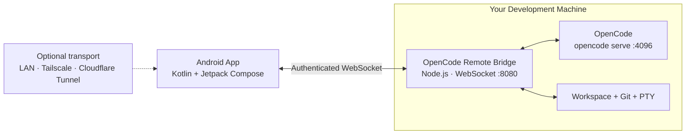
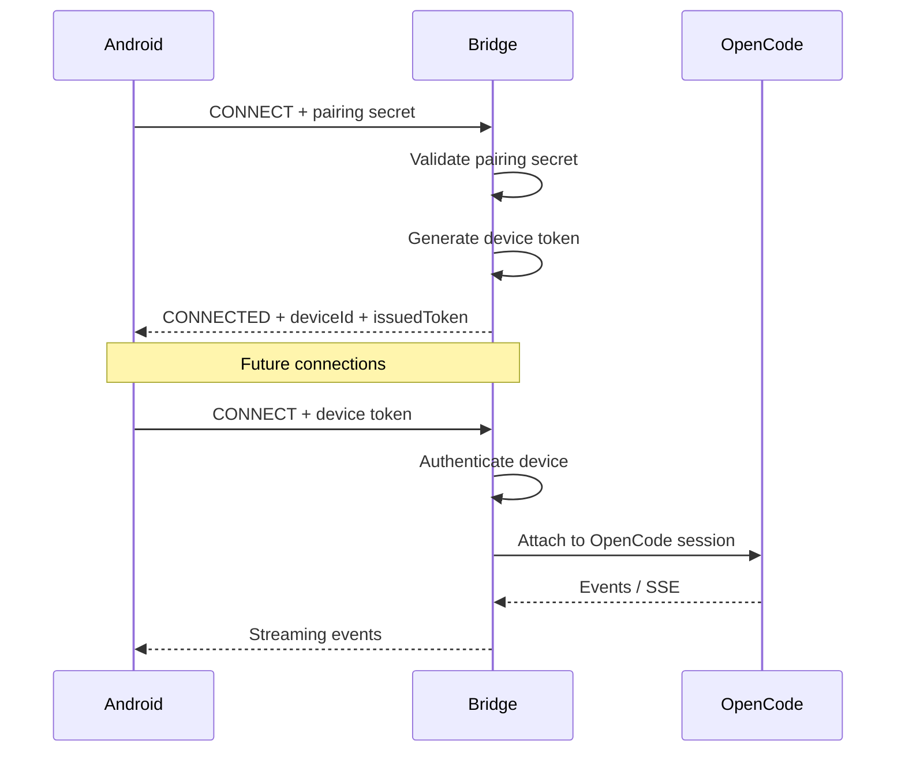

# OpenCode Remote

<p align="center">
  <strong>A native Android remote control for OpenCode.</strong><br/>
  Run the agent on your development machine. Control it from your phone.
</p>

<p align="center">
  
  
  
  
</p>

**OpenCode Remote** is a self-hosted Android client for [OpenCode](https://opencode.ai).

OpenCode continues to run on your laptop or workstation with direct access to your repositories, filesystem, shell, Git, language servers, and local development environment. OpenCode Remote gives you a purpose-built mobile interface to control that session from Android.

From your phone you can:

- stream agent responses in real time
- approve or deny tool permissions
- answer agent questions
- inspect multi-file diffs
- use an interactive PTY terminal
- browse project files
- switch and fork OpenCode sessions
- run constrained Git operations
- interrupt or steer running tasks
- manage paired devices

**LAN-first. No hosted OpenCode Remote backend is required.**

For access outside your local network, use your own private networking layer such as **Tailscale**, or optionally expose the bridge through a tunnel such as **Cloudflare Tunnel**.

---

## Why OpenCode Remote?

SSH gives you a shell.

A mobile browser gives you a webpage.

Neither is a particularly good interface for supervising an autonomous coding agent from a phone.

OpenCode Remote exposes the parts of an agent workflow that actually matter on mobile:

| Capability | OpenCode Remote |
|---|:---:|
| Live agent streaming | ✓ |
| Tool permission approval | ✓ |
| Agent question prompts | ✓ |
| Multi-file diff review | ✓ |
| Interactive PTY terminal | ✓ |
| File browser | ✓ |
| Session switching / forking | ✓ |
| Task interruption | ✓ |
| Git operations | ✓ |
| Device revocation | ✓ |
| Audit trail | ✓ |
| Native Android UI | ✓ |

The Android client is built with **Kotlin + Jetpack Compose + Material 3** rather than wrapping OpenCode in a WebView.

---

## Architecture



The bridge is deliberately small.

It sits between the Android client and the local OpenCode process and handles:

- authentication
- device pairing
- WebSocket event routing
- OpenCode SSE streaming
- permission requests
- session management
- filesystem confinement
- terminal I/O
- Git execution
- audit logging

Your actual development environment stays on the host machine.

---

## What Works Today

### Agent control

- Real-time OpenCode response streaming
- incremental text deltas
- tool-call events
- tool results
- prompt submission
- task cancellation
- mid-task steering
- concurrent message queuing

### Interactive agent requests

OpenCode permission and question events become native Android cards.

Approve or deny operations such as:

```bash
write_file
edit
filesystem access
```

Agent clarification requests can also be answered directly from the phone.

### Interactive PTY

The terminal is not a static command-output view.

It supports:

- streaming terminal output
- ANSI sequences
- interactive input
- terminal resizing
- dynamic `cols` / `rows`
- keyboard-induced viewport changes
- orientation changes

### Diff review

Inspect unified diffs generated while the agent modifies the workspace.

Multi-file changes can be reviewed without opening the repository on the host machine.

### Session management

From Android you can:

- list sessions
- create sessions
- switch sessions
- fork sessions
- interrupt active tasks

The active session ID survives bridge restarts through:

```code
.opencode-remote-session.json
```

### Workspace browser

Browse registered workspaces and source files directly from the phone.

Filesystem operations are confined to:

```code
WORKSPACE_ROOT
```

Paths are resolved before access to prevent simple `../` traversal outside the configured workspace boundary.

### Git

The bridge exposes a restricted Git interface rather than passing arbitrary Git strings directly through a shell.

Supported operations include:

```bash
status
add
commit
diff
log
branch
stash
push
pull
checkout
```

Git input is tokenized and shell chaining operators are rejected before execution.

### Device authentication

Initial pairing uses a one-time secret.

Successful pairing creates a separate persistent token for that device.

That means a lost phone can be revoked without rotating every other paired device.

### Audit trail

Security-relevant operations are written as JSON Lines records to:

```bash
.opencode-remote-audit.log
```

Recorded events include:

- terminal commands
- Git actions
- permission decisions
- device identity
- timestamps

---

# Quick Start

## Requirements

Host machine:

- Node.js 18+
- OpenCode CLI
- Git

Android:

- Android 7.0 / API 24+
- Android Studio for building from source
- JDK 17+

The project currently targets / compiles against Android SDK 36.

---

## 1. Start the bridge

```bash
git clone <YOUR_REPOSITORY_URL>
cd opencode-remote/bridge

npm install
npm test
npm start
```

The bridge prints:

- its listening address
- a QR pairing code
- the pairing secret

Default bridge port:

```text
8080
```

OpenCode is started through:

```bash
opencode serve
```

on port:

```text
4096
```

---

## 2. Build the Android app

```bash
cd android-application

./gradlew :app:testDebugUnitTest
./gradlew :app:assembleDebug
```

APK:

```text
android-application/app/build/outputs/apk/debug/app-debug.apk
```

Install using ADB:

```bash
adb install -r app/build/outputs/apk/debug/app-debug.apk
```

Or open `android-application/` in Android Studio and run the app normally.

---

## 3. Pair

Open **OpenCode Remote**.

On the Pair Device screen:

1. Tap **Scan QR Code**
2. Scan the code shown by the bridge
3. Tap **Connect**

You can also enter the host address and pairing secret manually.

Once pairing succeeds, the one-time secret is exchanged for a persistent per-device credential.

Future connections use the device credential instead of the pairing secret.

---

## Pairing Model



Device registrations are stored in:

```text
~/.opencode-remote-devices.json
```

The Android application stores its credential in encrypted application storage.

A device can be revoked independently from the Settings screen.

---

# Remote Access

## Tailscale

For most users, **Tailscale is the simplest remote-access option**.

Install Tailscale on both:

- the development machine
- the Android phone

Join both devices to the same tailnet.

Start the bridge normally:

```bash
cd bridge
npm start
```

Then connect the Android client to the machine's Tailscale address:

```text
100.x.y.z:8080
```

Tailscale encrypts traffic between devices using WireGuard.

No router port-forwarding is required.

---

## Cloudflare Tunnel

Cloudflare Tunnel can also publish the bridge without opening an inbound router port.

Create a tunnel:

```bash
cloudflared tunnel login

cloudflared tunnel create opencode-remote

cloudflared tunnel route dns \
  opencode-remote \
  bridge.example.com
```

Configure the tunnel:

```yaml
tunnel: <TUNNEL_UUID>
credentials-file: /home/<USER>/.cloudflared/<TUNNEL_UUID>.json

ingress:
  - hostname: bridge.example.com
    service: http://localhost:8080

  - service: http_status:404
```

Run it:

```bash
cloudflared tunnel run opencode-remote
```

Then configure the Android client to connect through the published hostname.

> Cloudflare Tunnel routes traffic through Cloudflare infrastructure. Use Tailscale if your requirement is an encrypted private network without exposing the bridge as a public hostname.

---

# Security Model

OpenCode Remote exposes capabilities that can modify source code and execute commands.

That makes the bridge a security boundary, not just a transport proxy.

### Per-device authentication

Initial pairing creates isolated credentials for each phone.

A compromised device can be revoked without changing credentials for other devices.

Authentication comparisons use timing-safe equality where appropriate.

### Filesystem confinement

File operations are resolved against the configured:

```text
WORKSPACE_ROOT
```

Requests that resolve outside that boundary are rejected.

For example:

```text
../../etc/passwd
```

must not escape the configured workspace.

### Restricted Git execution

The Git interface accepts an explicit set of supported subcommands.

Shell control operators such as:

```text
&&
|
;
`
```

are rejected instead of being forwarded directly into a shell command.

### Explicit permission decisions

The bridge does not silently convert OpenCode permission requests into approvals.

If OpenCode asks for permission, execution waits for an explicit decision from the client.

### Device revocation

Each paired phone has its own credential.

Revoking one device does not invalidate every client.

### Audit logging

Terminal commands, Git operations, and permission decisions are appended to the local audit file.

The audit log is intended for traceability.

It is **not currently a cryptographically tamper-evident log**. A user or process with sufficient access to the host filesystem may modify it.

---

## Transport Security

There is an important distinction between **authentication** and **transport encryption**.

### Local LAN

A direct:

```text
ws://192.168.x.x:8080
```

connection uses application-level device authentication but does **not** provide TLS encryption by itself.

Use a trusted local network or an encrypted overlay network.

### Tailscale

Tailscale provides an encrypted network between the Android device and host.

This is the recommended configuration for remote access.

### Cloudflare Tunnel

Cloudflare Tunnel provides encrypted transport to Cloudflare's network and avoids exposing a listening port directly on your router.

It does, however, introduce Cloudflare infrastructure into the connection path.

---

# Threat Model

OpenCode Remote is designed to reduce exposure to:

- unauthenticated remote clients
- stolen/revoked device credentials
- basic path traversal
- unrestricted Git shell execution
- accidental silent agent permission approval

It does **not** attempt to protect against:

- malware already running under your host user account
- an attacker with full access to your unlocked phone
- root/administrator compromise of the host
- malicious modifications to the bridge source itself
- vulnerabilities in OpenCode, Node.js, Android, Tailscale, Cloudflare, or other dependencies

The bridge runs with the permissions of the user who starts it.

It does not provide privilege escalation.

---

<details>
<summary><strong>Bridge configuration</strong></summary>

<br/>

| Variable | Default | Purpose |
|---|---|---|
| `PORT` | `8080` | Bridge WebSocket port |
| `OPCODE` | `opencode` | OpenCode executable |
| `BRIDGE_TOKEN` | Random secret | Initial pairing secret |
| `WORKSPACE_ROOT` | Current directory | Filesystem boundary |
| `DEVICE_STORE_PATH` | `~/.opencode-remote-devices.json` | Authorized devices |
| `AUDIT_LOG_PATH` | `<WORKSPACE_ROOT>/.opencode-remote-audit.log` | Audit records |
| `OC_SERVE_PORT` | `4096` | OpenCode server port |
| `OC_PROMPT_TIMEOUT_MS` | `120000` | Prompt timeout |

Example:

```bash
WORKSPACE_ROOT=/home/vipul/projects \
PORT=8080 \
npm start
```

</details>

---

<details>
<summary><strong>WebSocket protocol</strong></summary>

<br/>

Frames use the following envelope:

```json
{
  "eventType": "EVENT_NAME",
  "payload": {}
}
```

### Android → Bridge

```text
CONNECT
PROMPT
PERMISSION_REPLY
QUESTION_REPLY
KILL_TASK
TERMINAL
TERMINAL_RESIZE
GIT
LIST_SESSIONS
SWITCH_SESSION
NEW_SESSION
FORK_SESSION
OPEN_WORKSPACE
ADD_WORKSPACE
FETCH_FILE_TREE
REVOKE_TOKEN
LIST_DEVICES
FETCH_AUDIT_LOG
```

### Bridge → Android

```text
CONNECTED
STREAM_TEXT_DELTA
STREAM_TOOL_CALL
STREAM_TOOL_RESULT
PERMISSION_REQUEST
QUESTION_REQUEST
FILE_DIFF
TERMINAL_OUTPUT
CHAT_MESSAGE
```

Full protocol:

[`bridge/API.md`](bridge/API.md)

</details>

---

<details>
<summary><strong>Repository layout</strong></summary>

<br/>

```text
opencode-remote/
├── bridge/
│   ├── main.js
│   ├── API.md
│   ├── README.md
│   ├── package.json
│   ├── test/
│   └── test-fixtures/
│
├── android-application/
│   ├── app/src/main/java/com/opencode/remote/
│   │   ├── MainActivity.kt
│   │   ├── data/
│   │   │   ├── dto/
│   │   │   ├── network/
│   │   │   ├── pairing/
│   │   │   └── storage/
│   │   └── ui/
│   │       ├── components/
│   │       ├── navigation/
│   │       ├── screens/
│   │       └── theme/
│   │
│   └── app/src/test/
│
├── adr/
│   └── 0001-per-device-tokens.md
│
└── tools/
```

</details>

---

# Verification

Bridge:

```bash
cd bridge
npm test
```

Current bridge suite:

```text
37 tests
```

Android:

```bash
cd android-application

./gradlew :app:testDebugUnitTest
./gradlew :app:assembleDebug
```

Expected result:

```text
BUILD SUCCESSFUL
```

The application has also been exercised on physical Android hardware.

---

# Current Limitations

### No per-hunk diff approval

OpenCode's current interface exposes whole-file diff information rather than a full interactive patch staging protocol.

OpenCode Remote therefore reviews diffs but does not implement arbitrary per-hunk agent patch acceptance.

### No bundled FCM infrastructure

Firebase Cloud Messaging is not configured by default.

FCM requires project-specific Firebase configuration and would introduce an additional external service.

While the application is alive or backgrounded, it uses its WebSocket connection for live events.

### Host permissions still apply

The bridge inherits the permissions of the operating-system user that launched it.

It deliberately does not attempt to provide root or administrator escalation.

### Audit logs are not immutable

The audit log is append-oriented for normal bridge operation, but it is not protected against modification by a sufficiently privileged local process.

---

# Contributing

Before opening a pull request:

```bash
cd bridge
npm test
```

and:

```bash
cd android-application
./gradlew :app:testDebugUnitTest
./gradlew :app:assembleDebug
```

Both suites should pass.

Architecture decisions live in:

[`adr/`](adr/)

Contribution guidelines:

[`CONTRIBUTING.md`](CONTRIBUTING.md)

---

## Built for the moments when opening the laptop is unnecessary

Review the agent's diff from the couch.

Approve a permission request from another room.

Check a long-running refactor while away from your desk.

Open a terminal when something actually needs intervention.

**The development environment stays on the development machine. The control surface goes with you.**